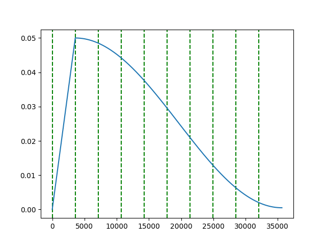

# Schedulers


### 1. Cosine Annealing Scheduler

#### 1.1 PeriodicCosineAnnealingLR

Cosine Annealing Scheduler with Periodicity 1

```python
    import timm
    from timm.optim import AdamP
    from trainer.schedulers.cosine import PeriodicCosineAnnealingLR    
    
    model = timm.create_model('resnet18', pretrained=True, num_classes=14)
    optimizer = AdamP(model.parameters(), lr=0.05, weight_decay=0.01)

    max_epoch = 50
    iter_per_epoch = 713
    warmup_epochs = 5

    scheduler = PeriodicCosineAnnealingLR(optimizer, eta_min=0.0005, max_epoch=max_epoch, 
                                        iter_per_epoch=iter_per_epoch, warmup_epochs=warmup_epochs)
    lrs = []
    brk = max_epoch * iter_per_epoch // 10
    for i in range(max_epoch * iter_per_epoch):
        optimizer.step()
        scheduler.step(i)
        lrs.append(optimizer.param_groups[0]['lr'])
        if i % brk == 0:
            plt.axvline(x=i, linestyle='--', color='green')  # 50의 배수일 때마다 초록색 점선 추가
    plt.plot(lrs)
    plt.show()
```
<p align="center">
  
</p>